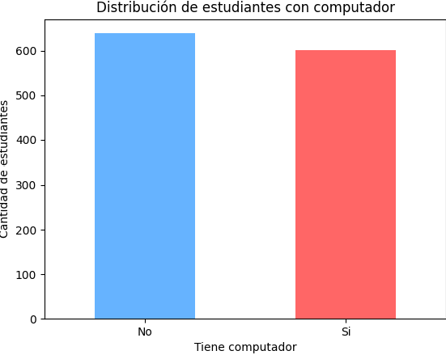

# Aquí voy a colocar la documentación

<details>
  <summary><strong><h1>Librerías</h1></strong></summary>

  - **Matplotlib**
  - **Pandas**

</details>



```python
if __name__ == '__main__':
    main(); 
```