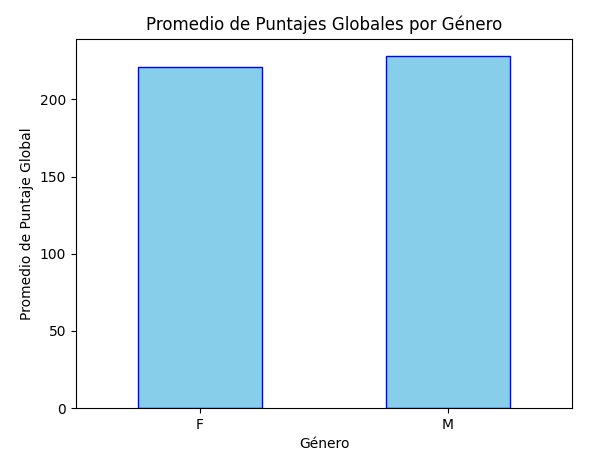
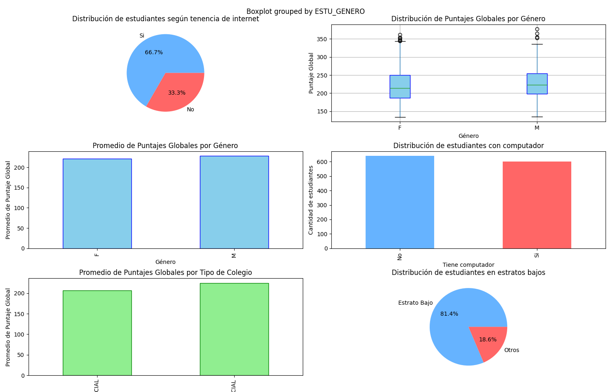

# Aquí voy a colocar la documentación

  
<strong>Librerías</strong>

  <ul>
    <li><strong>Matplotlib</strong> - Para visualización de datos gráficos.</li>
    <li><strong>Pandas</strong> - Para manipulación y análisis de datos.</li>
  </ul>

<h2 style="color: #333;">Gráficas</h2>

A continuación se muestran diferentes gráficos para visualizar el comportamiento de los datos:

<h3 style="color: #007bff;">Estudiantes con Computadora</h3>

<h3 style="color: #007bff;">Distribución de Estudiantes por Género</h3>

<h3 style="color: #007bff;">Otras Gráficas Importantes</h3>

<h2 style="color: #333;">Código Python</h2>

A continuación se muestra el código Python correspondiente:

<pre style="background-color: #f5f5f5; padding: 15px; border-radius: 5px; font-family: 'Courier New', Courier, monospace;">
<code>if __name__ == '__main__':
    main(); 
</code>
</pre>
